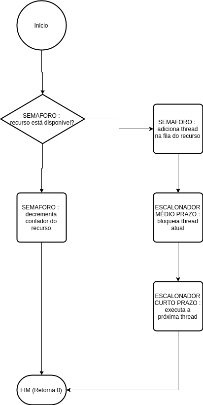

# Meeting #2 - 01/05/2017

##### Present members :
Guilherme, Juliano

##### Key points:
1. Remodelled architecture for better modularization
2. Queues are now modules that should hide their implementation and provide clear interfaces.
    * Ready queue :
        * Should hide the 4 priority queues inside it and provide interface to add or remove threads.
        * Will bear the responsability of encapsulate the `next thread algorithm`  so that no other module should have to access individual priority queues.
    * Blocked queue :
        * One simple queue with add/remove interface.
    * Execution queue :
        * Internally it is a `one thread queue`, as our CThreads will only execute one thread at a time.
        * We still don't know if it should bear the responsability of saving context on thread switches.
3. First interface functions thoughts : diagrams.

##### Architecture

##### Project

##### Ccreate

##### Cjoin

##### Cwait

##### Csignal

##### Cyield

