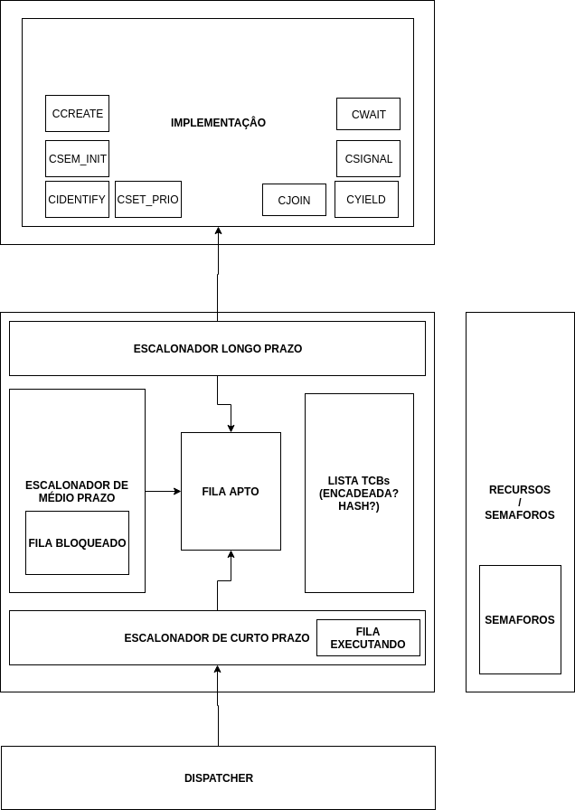

# Meeting #1 - 28/04/2017

##### Present members :
Guilherme, Vilmar

##### Key points:
1. Architecture division in schedulers.
    * Long term scheduler : threads creation.
    * Medium term scheduler : blocks and unblocks threads.
    * Short term scheduler : executes and stops executing threads.
2. Decided to have a separate module for semaphores mangagement. We still don't know how or were it should be inside the architecture.
3. Discussed the possibility of having a module for managing Thread Controll Blocks (TCBs).
4. Should we have a dispatcher?
5. Should we have separate modules for queues?

##### Architecture

